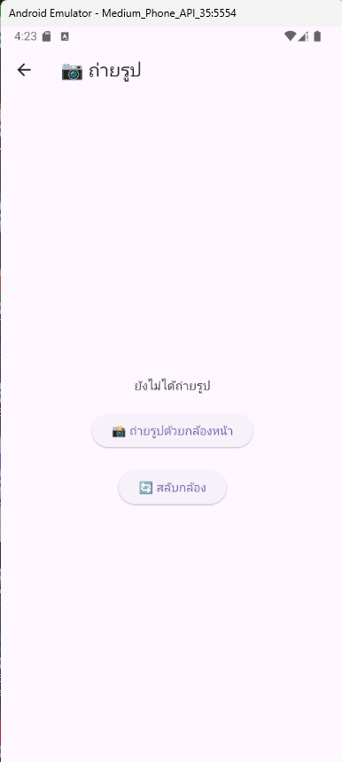

# flutter camera

นี่คืองานตัวอย่างที่สร้างด้วย Flutter

## ฟีเจอร์หลัก
- ถ่ายภาพ
- สลับกล้องหน้าและหลัง
- บันทึกภาพลงแกลเลอรี

## วิธีการติดตั้ง

### 1. โคลนโปรเจกต์นี้

```bash
git clone https://github.com/thanachok11/flutter_camera.git
```

### 2. ติดตั้ง dependencies
 ```bash
flutter pub get
```
### 3. ตัวอย่างรูปภาพ
นี่คือลักษณะของโปรเจกต์เมื่อรันแอป

home page  
 

camera page  


choose image  


gallery page  


full screen page  


